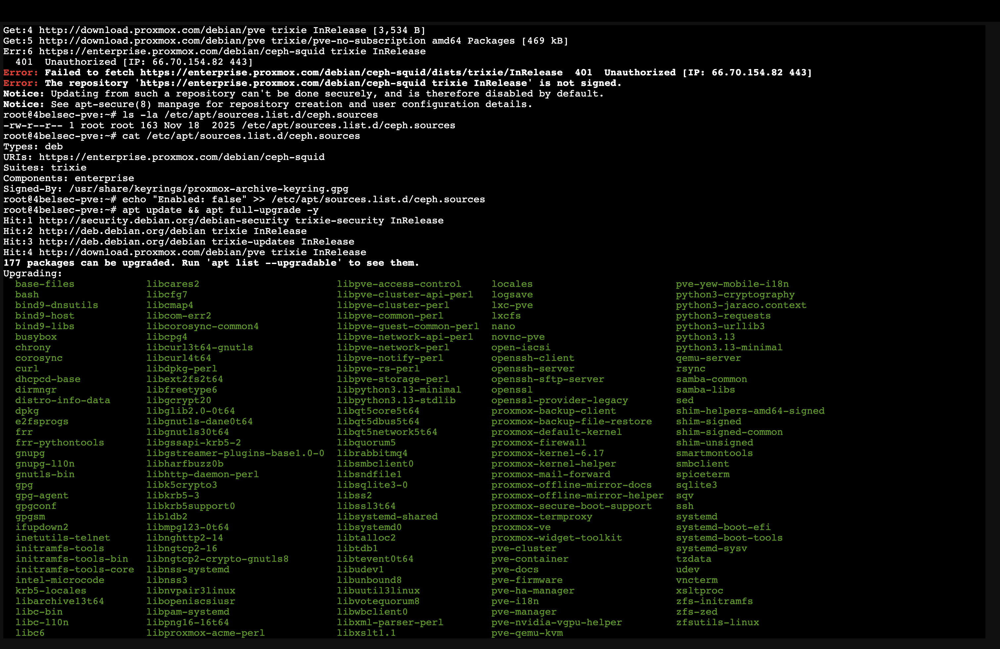
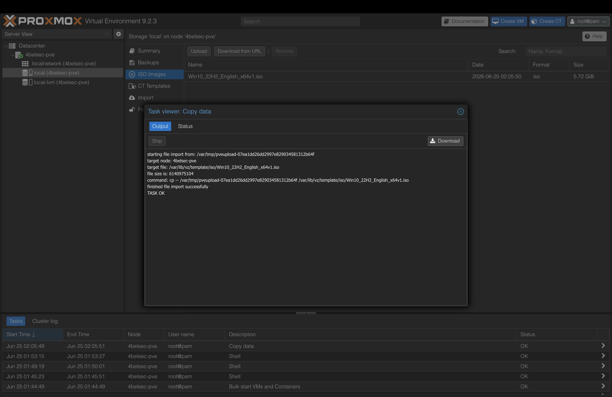
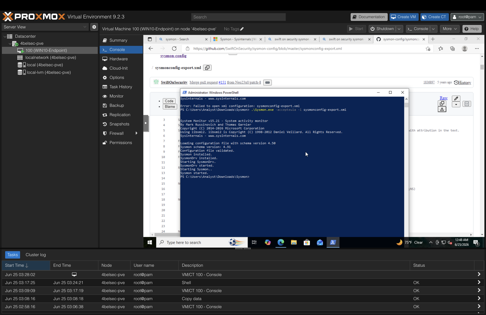
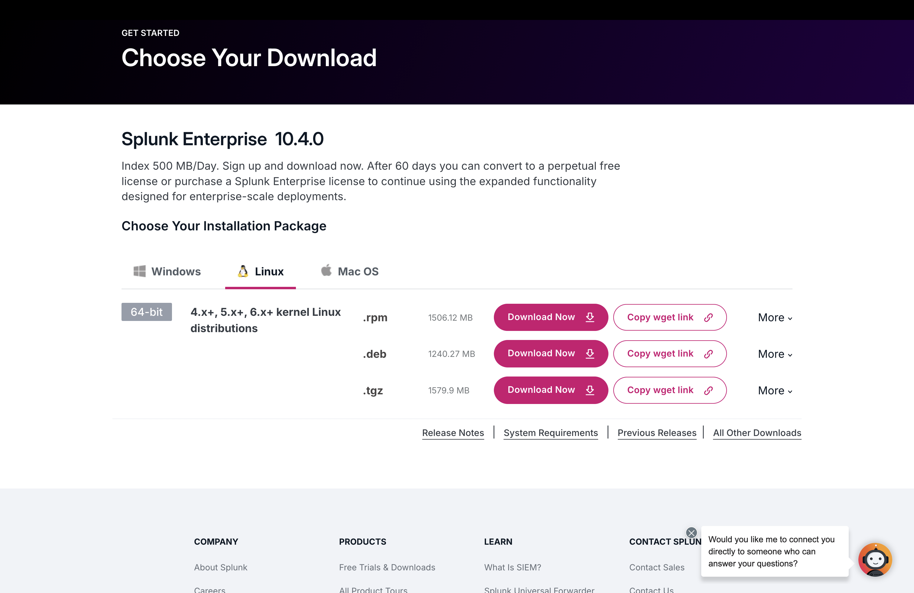
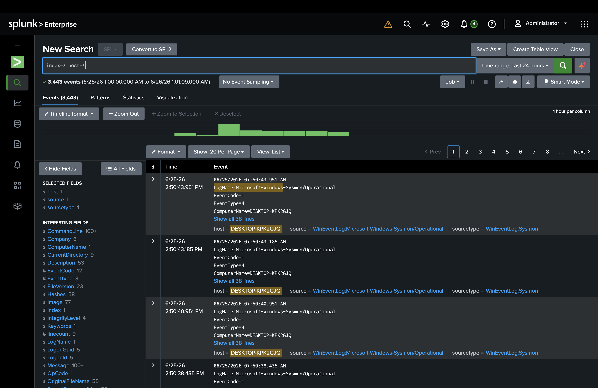
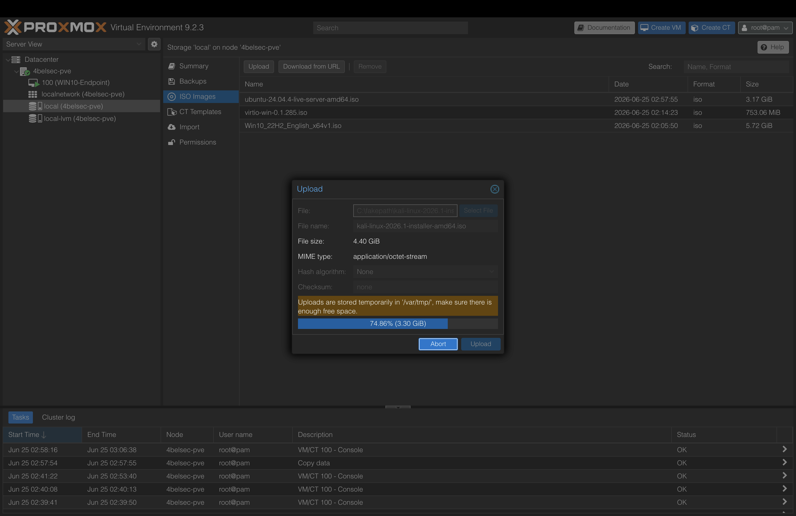
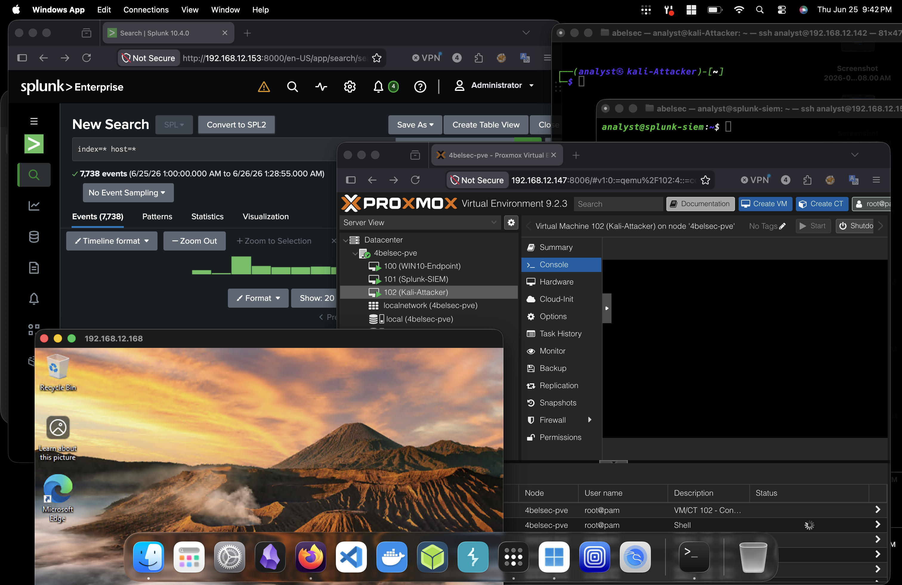

# SOC Home Lab

A self-built home lab simulating a corporate SOC environment — built to practice detection engineering, log analysis, and incident investigation as part of my transition into a SOC Analyst role.

## Architecture

| Component | Role | Stack |
|---|---|---|
| Hypervisor | Virtualization host | Proxmox VE 9.2.3 |
| Endpoint | Simulated corporate workstation | Windows 10 Pro + Sysmon |
| SIEM | Log ingestion & analysis | Splunk Enterprise 10.4.0 |
| Attacker | Threat simulation | Kali Linux |
| Remote Access | Secure access without port forwarding | Tailscale |

**Data flow:** Windows generates activity → Sysmon captures it → Splunk Universal Forwarder ships it → Splunk indexes and displays it in real time.

---

## 1. Hypervisor Setup (Proxmox)

Started by moving off Proxmox's paid enterprise repositories to the free no-subscription repos, and fixing a Ceph repo authentication error along the way.

Key steps:
- Disabled `pve-enterprise.sources` and `ceph.sources`
- Added the `pve-no-subscription` repo
- Installed [Tailscale](https://tailscale.com) on the host for remote access without router port forwarding — critical since my ISP (AT&T) doesn't support easy port forwarding
- Enabled IP forwarding and subnet routing so I can SSH/RDP directly into any VM remotely

---

## 2. Endpoint: Windows 10 + Sysmon

Installed Windows 10 Pro and configured Sysmon using the [SwiftOnSecurity config](https://github.com/SwiftOnSecurity/sysmon-config) — the industry-standard baseline for high-quality event tracing.

Installation command:

    .\Sysmon64.exe -accepteula -i sysmonconfig-export.xml

This generates real security telemetry (process creation, network connections, etc.) under:
`Applications and Services Logs → Microsoft → Windows → Sysmon → Operational`

---

## 3. SIEM: Splunk Enterprise on Ubuntu Server

Installed Splunk Enterprise on Ubuntu Server 24.04. One notable fix: Splunk initially ran as root, which it actively warns against. Reconfigured it to run as a non-privileged user:

    chown -R analyst:analyst /opt/splunk
    /opt/splunk/bin/splunk start --accept-license
    /opt/splunk/bin/splunk enable boot-start -user analyst

Also had to expand the VM's LVM partition (started with only 19GB usable, Splunk requires 5GB minimum free space to run queries):

    lvextend -l +100%FREE /dev/ubuntu-vg/ubuntu-lv
    resize2fs /dev/mapper/ubuntu--vg-ubuntu--lv

---

## 4. Forwarding Sysmon Logs to Splunk

Installed the Splunk Universal Forwarder on the Windows endpoint and configured it to ship Sysmon logs to the indexer.

**outputs.conf:**

    [tcpout]
    defaultGroup = default-autolb-group

    [tcpout:default-autolb-group]
    server = 192.168.X.X:9997

**inputs.conf:**

    [WinEventLog://Microsoft-Windows-Sysmon/Operational]
    disabled = false
    index = main
    sourcetype = WinEventLog:Sysmon

**The real troubleshoot:** the Forwarder connected fine but Sysmon logs weren't arriving. The splunkd log revealed the issue:

    ERROR WinEventLogChannel::init: Init failed, unable to subscribe to Windows Event Log channel
    'Microsoft-Windows-Sysmon/Operational': errorCode=5

`errorCode=5` is Access Denied — the Forwarder's service account didn't have permission to read the Sysmon Operational channel (which has stricter ACLs than standard Windows logs). Fixed by reconfiguring the service to run as `LocalSystem`:

    sc.exe config SplunkForwarder obj= "LocalSystem"
    Restart-Service SplunkForwarder

---

## 5. Result: End-to-End Data Flow Confirmed

3,400+ Sysmon events flowing into Splunk in real time, confirmed via the search:

    index=* host=*

---

## 6. Attacker Node: Kali Linux

Installed Kali Linux (XFCE desktop) as the threat simulation node — used to generate attack traffic (port scans, brute force attempts) for the SOC stack to detect and the SIEM to surface.

---

## Full Stack Overview

---

## What's Next

- [x] Generate and document a real brute-force attack from Kali against the Windows endpoint — see [soc-labs](https://github.com/4belSec/soc-labs/blob/main/cases/01-rdp-brute-force.md)
- [x] Write detection logic (SPL queries) for the captured activity
- [ ] Add TheHive for case management and incident ticketing
- [ ] Add MISP for threat intelligence correlation
- [ ] Generate and document additional attack scenarios (phishing simulation, port scanning)
---

## Related Write-ups
See [`soc-labs`](https://github.com/4belSec/soc-labs) for incident analysis and investigation write-ups based on activity captured in this lab.
